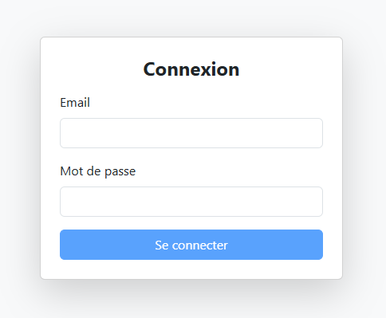
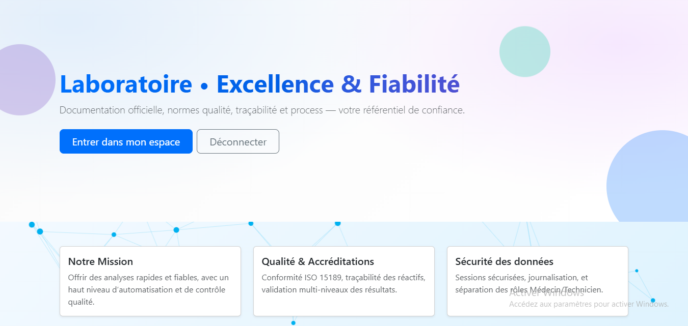
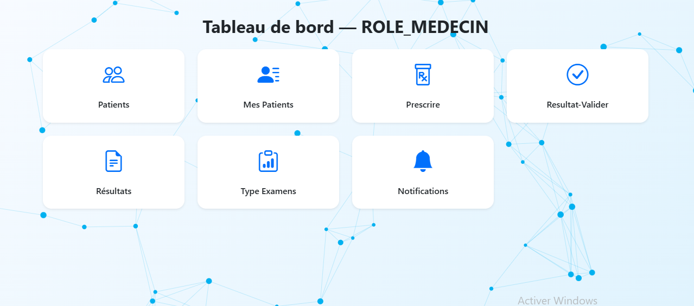
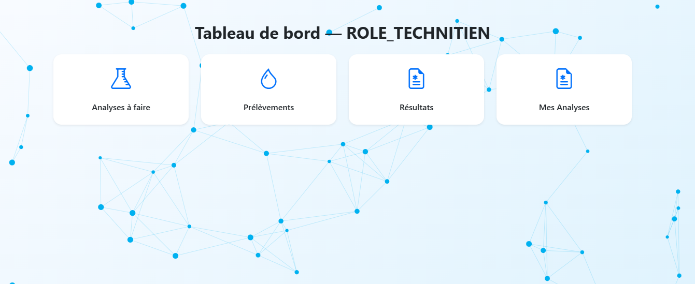

# Tuto-Agular : Système de Gestion de Laboratoire Médical

[](https://vercel.com)
[](https://angular.dev)

Une application web moderne pour la gestion complète d'un laboratoire d'analyses médicales, permettant la collaboration entre médecins et techniciens de laboratoire.

---

## Captures d'écran

> [!TIP]  
> Pour afficher vos photos ici, placez-les dans le dossier `/screenshots` et mettez à jour les liens ci-dessous.

|               Connexion              |                   Accueil apres connexion                   |
| :-------------------------------------------: | :-------------------------------------------------: |
|  |  |
|      _Interface de connexion sécurisée_       |           _Vue d'ensemble des activités_            |

|                    Espace Médecin                     |                 Espace Technicien                 |
| :---------------------------------------------------: | :-----------------------------------------------: |
|  |  |
|         _Prescription et suivi des patients_          |      _Gestion des prélèvements et résultats_      |

---

## Fonctionnalités Clés

### Pour les Médecins

- **Gestion des Patients** : Consultation et recherche dans la liste des patients.
- **Prescriptions** : Création de demandes d'analyses médicales.
- **Validation** : Revue et validation des résultats d'analyses.
- **Notifications** : Alertes en temps réel sur l'état des analyses.

### Pour les Techniciens

- **Gestion des Prélèvements** : Suivi des échantillons reçus.
- **Saisie des Résultats** : Enregistrement méticuleux des données d'analyses.
- **Gestion des Réactifs** : Inventaire et suivi des produits de laboratoire.
- **Examens** : Configuration des types d'examens disponibles.

### Pour les Secrétaires

- **Gestion des Réactifs** : Supervision et mise à jour des stocks de réactifs.
- **Types d'Examens** : Paramétrage et organisation des différents examens médicaux.

---

## Stack Technique

- **Frontend** : [Angular v20](https://angular.dev) (Signals, Router, HttpClient)
- **Styling** : [Bootstrap 5](https://getbootstrap.com) & [Bootstrap Icons](https://icons.getbootstrap.com)
- **Déploiement** : [Vercel](https://vercel.com) & [GitHub Pages](https://pages.github.com)
- **Animations** : Loader personnalisé et transitions fluides.

---

## Installation & Lancement

### Prérequis

- [Node.js](https://nodejs.org) (v18+)
- [Angular CLI](https://github.com/angular/angular-cli)

### Étapes

1. **Cloner le projet**

   ```bash
   git clone <votre-url-github>
   cd mon-projet-frontend
   ```

2. **Installer les dépendances**

   ```bash
   npm install
   ```

3. **Lancer le serveur de développement**
   ```bash
   npm start
   ```
   Accédez à l'application sur `http://localhost:4200/`.

---

## Build & Déploiement

### Production

Pour générer les fichiers de production :

```bash
npm run build
```

### Vercel

Le projet est configuré pour un déploiement rapide sur Vercel via le fichier `vercel.json`.

---

## Auteur

Développé avec par Noubam Adrien
